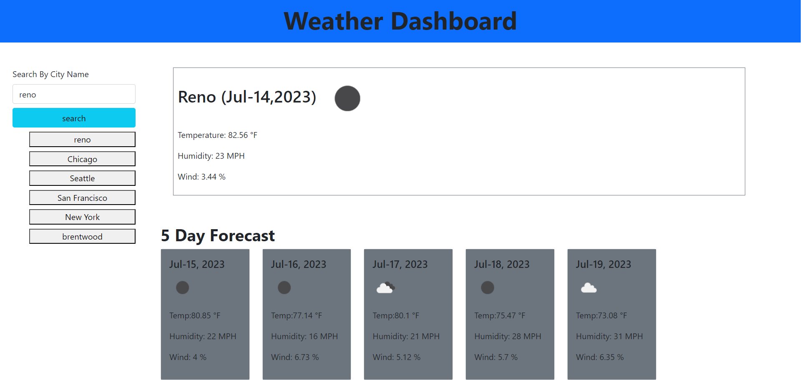

# Weather Dashboard

## Description

This Weather Dashboard is a web page designed to display weather information for a specific city. It allows users to search for a city by name and retrieve the current weather conditions as well as a 5-day forecast. The page is built using HTML, CSS, and JavaScript, with the help of the Bootstrap framework.
 [visit the Deployed site](https://github.com/ssherp/weather-board/)

## Features

•	Search by City Name: Users can enter a city name in the search input field to retrieve weather information for that city.
•	Search History: The page keeps track of the search history and displays the most recent cities searched. Users can click on a city from the history list to quickly retrieve its weather information.
•	Current Weather: The current weather section displays the city name, date, weather icon, temperature, humidity, and wind speed.
•	5 Day Forecast: The forecast section displays a 5-day forecast for the selected city, including the date, weather icon, temperature, humidity, and wind speed for each day.

## Usage

To use the Weather Dashboard, follow these steps:
1.	Enter a city name in the "Search By City Name" input field.
2.	Click the "Search" button or press Enter to retrieve the weather information for the specified city.
3.	The current weather and 5-day forecast sections will be populated with the retrieved data.
4.	The search history will be updated with the searched city. You can click on a city in the history list to retrieve its weather information again.

## Technologies Used

•	HTML: The structure and layout of the web page are defined using HTML.
•	CSS: The styling and appearance of the page elements are defined using CSS.
•	JavaScript: The dynamic behavior and functionality of the page are implemented using JavaScript.
•	Bootstrap: The Bootstrap framework is used for responsive layout and pre-styled components.
•	OpenWeather API: Weather data is fetched from the OpenWeather API to populate the weather information.

### Sonam Sherpa 

* [Portfolio](https://ssherp.github.io/portfolio/)
* [LinkedIn](https://www.linkedin.com/in/sonam-sherpa-306559280)
* [Github](https://github.com/ssherp/weather-board/)

## The Weather Dashboard consists of the following files:

•	index.html: The main HTML file that defines the structure of the page.
•	style.css: The CSS file that contains the custom styles for the page.
•	script.js: The JavaScript file that implements the functionality of the page.
•	assets/: A directory that contains additional assets used by the page, such as weather icons and external libraries.

## Setting Up 

To set up the Weather Dashboard locally, follow these steps:
1.	Download the project files to your computer or clone the repository.
2.	Open the index.html file in a web browser.
3.	The Weather Dashboard should now be displayed, and you can start using it to search for weather information.

## Learning Points

The development of this Weather Dashboard provided several learning points for me in a coding bootcamp. Some key takeaways include:
1.	HTML Structure: Learn about structuring a web page using HTML tags and elements. They can understand the importance of semantic HTML and how to organize content effectively.
2.	Responsive Design: By utilizing the Bootstrap framework, you can gain knowledge about creating responsive web designs. You can understand how to use Bootstrap's grid system, components, and utility classes to ensure the page adapts well to different screen sizes.
3.	JavaScript Functionality: Implement JavaScript code to add dynamic behavior to the page. You can learn about DOM manipulation, event handling, and making API requests to retrieve weather data from external sources.
4.	API Integration: By incorporating the OpenWeather API, you can learn how to work with third-party APIs to fetch data and integrate it into their web applications, understand the concept of making HTTP requests, handling responses, and parsing JSON data.
5.	Local Storage: Explore the use of browser's local storage to store and retrieve search history. learn how to store data persistently on the user's device and utilize it to enhance the user experience.

